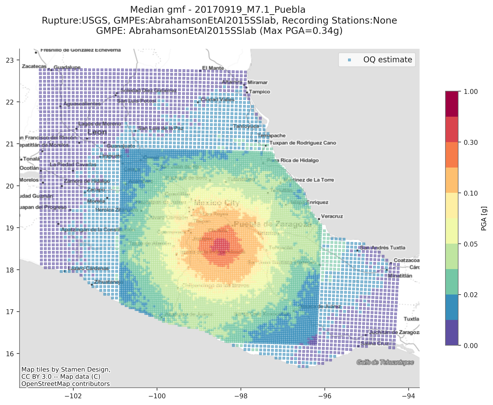
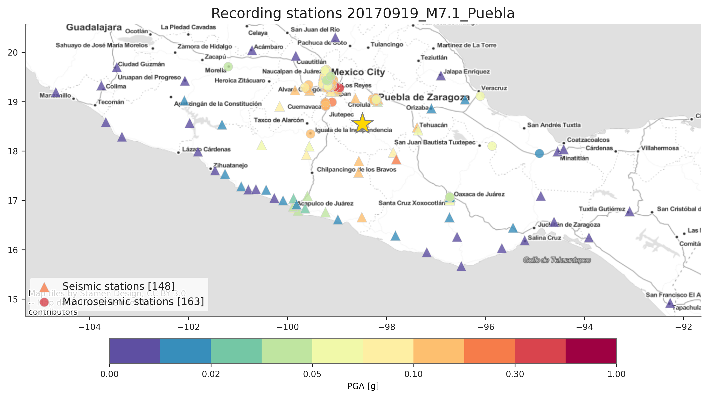
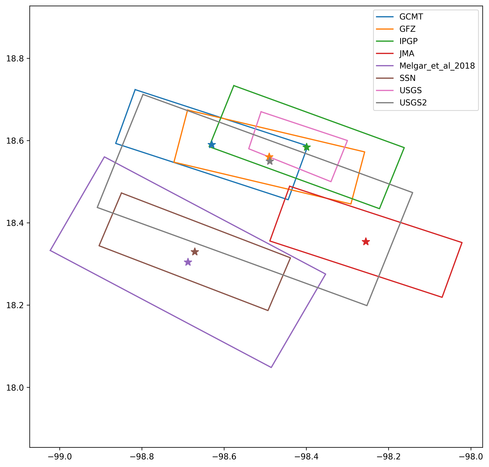

# 🌎  PUEBLA EARTHQUAKE Mw7.1, 2017-09-19 

This folder includes detailed information about the Puebla earthquake Mw7.1 in Mexico 2017-09-19.

Available information:  

## Impact

Detailed information at different geographical detail on the impact in population and infrastructure.
- Building damage
- Human impact 
- Economic losses

## OpenQuake_gmfs

Input files to generate the ground motion fields considering the recording stations for the event.
This folder includes the rupture file and the configuration file (`job.in`).

## Recording_Stations

Collection of available recording stations recorded during the event.

## Rupture 
Listing of possible rupture solutions for the event.

# ☄️ The earthquake at a glance 

Summary of the [main consequences](./earthquake_information.csv) experienced after the event:

| FIELD                 | DESCRIPTION          |
|-----------------------|----------------------|
| Year                  | 2017                 |
| Country               | Mexico               |
| Region                | Puebla               |
| Event_Name            | Puebla_2017          |
| Local_Date            | 19/09/17             |
| Local_Time            | 13:14:39             |
| Latitude              | 18.3297              |
| Longitude             | -98.6712             |
| Depth_(km)            | 51.2                 |
| Mw                    | 7.1                  |
| Fault mecanism        | Normal fault         |
| Tectonic region type  | Subduction Intraslab |
| Max_Intensity_(MMI)   | VIII                 |
| Fatalities            | *! what to report ?  |
| Injured               | *! what to report ?  |
| Displaced_Population  | *! what to report ?  |
| Affected_Population   | *! what to report ?  |
| Buildings_Affected    | *! what to report ?  |
| Buildings_Damaged     | *! what to report ?  |
| Buildings_Collapsed   | *! what to report ?  |
| Economic_Losses       | *! what to report ?  |
| Insured_Losses        | *! what to report ?  |
| Induced_Effects       | *! what to report ?  |
| USGS identifier       | [us2000ar20](https://earthquake.usgs.gov/earthquakes/eventpage/us2000ar20/executive) |
| NOAA identifier       | to be added |
 

# 🌟 Contributors 

| NAME                   | ORGANIZATION                         | CONTRIBUTION               |
|------------------------|--------------------------------------|----------------------------|
| Zarrin Karimzadeh      | University of Aveiro, PhD candidate  | Main data collection       |
| Catalina Yepes-Estrada | GEM Foundation                       | Data collection and review |
| Juanito Perez          | Consultant                           | Add impact data in city XX |
