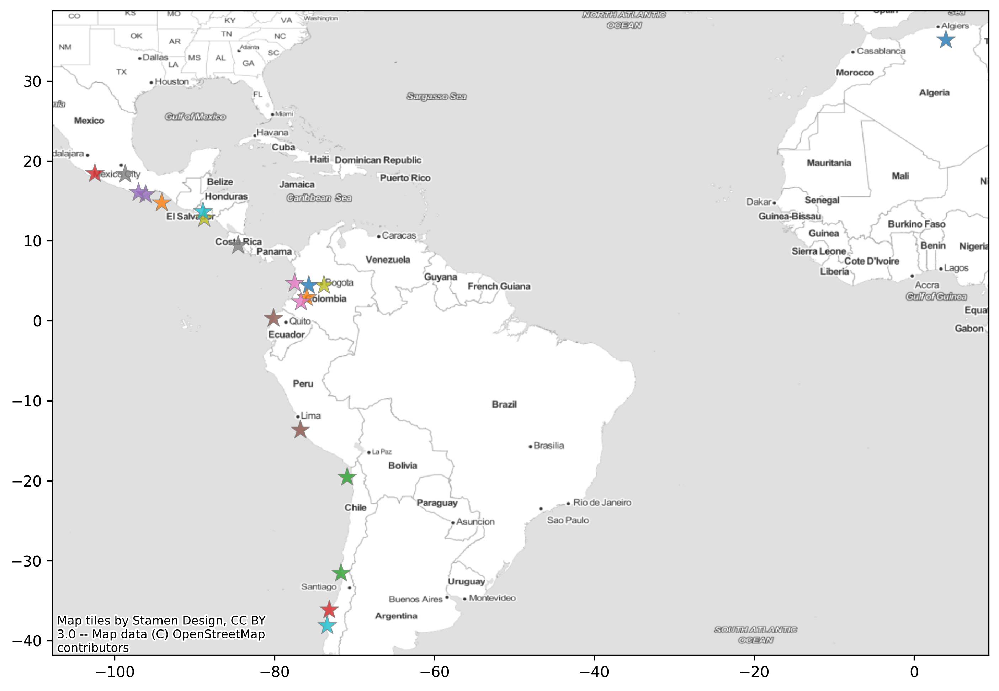

<!--  -->

---

# 🌟 EARTHQUAKE CONSEQUENCE DATABASE

This repository is a collection of earthquake footprints and consequences from past event.

Currently you can find in the database the following events:

| Event_ID                  |   Year | Country          | Event_Name        |     Mw |   Depth_(km) |
|:--------------------------|-------:|:-----------------|:------------------|-------:|-------------:|
| 20200623_M7.4_Oaxaca      |   2020 | Mexico           | Oaxaca_2020       |   7.4  |       nan    |
| 20170403_M6.5_Moijabana   |   2017 | Botswana         | nan               |   6.46 |        23.5  |
| 20170908_M8.2_Chiapas     |   2017 | Mexico           | Chiapas_2017      |   8.2  |        45.9  |
| 20171113_M6.5_Puntarenas  |   2017 | Costa Rica       | Puntarenas_2017   |   6.5  |        22    |
| [20170919_M7.1_Puebla](./Mexico/20170919_M7.1_Puebla)      |   2017 | Mexico           | Puebla_2017       |   7.1  |        51.2  |
| 20160416_M7.8_Pedernales  |   2016 | Ecuador          | Pedernales_2016   |   7.8  |        17    |
| 20160910_M5.9_Bukoba      |   2016 | Tanzania, Uganda | nan               |   5.9  |        40    |
| 20150916_M8.3_Illapel     |   2015 | Chile            | Illapel_2015      |   8.3  |        22.44 |
| 20140401_M8.2_Iquique     |   2014 | Chile            | Iquique_2014      |   8.2  |        38.9  |
| 20100227_M8.8_Maule       |   2010 | Chile            | Maule_2010        |   8.8  |        30    |
| 20080524_M5.9_Quetame     |   2008 | Colombia         | Quetame_2008      |   5.9  |        10    |
| 20070815_M7.9_Pisco       |   2007 | Peru             | Pisco_2007        |   7.9  |        40    |
| 20041115_M7.2_Pizarro     |   2004 | Colombia         | Pizarro_2004      |   7.2  |        15    |
| 20040224_M6.3_AlHoceima   |   2004 | Morocco          | AlHoceima_2004    |   6.3  |        12.2  |
| 20030521_M6.8_Boumerdes   |   2003 | Algeria          | nan               |   6.8  |        12    |
| 20010113_M7.6_SanMiguel   |   2001 | El Salvador      | San Miguel_2001   |   7.6  |        39    |
| 20010213_M6.6_SanSalvador |   2001 | El Salvador      | San Salvador_2001 |   6.6  |        13    |
| 19990125_M6.1_Armenia     |   1999 | Colombia         | Armenia_1999      |   6.1  |        15    |
| 19990930_M7.4_Oaxaca      |   1999 | Mexico           | Oaxaca_1999       |   7.4  |       nan    |
| 19940606_M6.8_Cauca       |   1994 | Colombia         | Cacua_1994        |   6.8  |        10    |
| 19921012_M5.9_Cairo       |   1992 | Egypt            | nan               |   5.8  |        21.5  |
| 19850919_M8.1_Michoacan   |   1985 | Mexico           | Mexico_Michoacan  |   8.1  |       nan    |
| 19830331_M5.6_Popayan     |   1983 | Colombia         | Popayán_1983      |   5.6  |        15    |
| 19600522_M9.5_Valdivia    |   1960 | Chile            | Valdivia_1960     |   9.5  |        25    |
| 20210907_M7.1_Guerrero    |    nan | nan              | nan               | nan    |       nan    |

