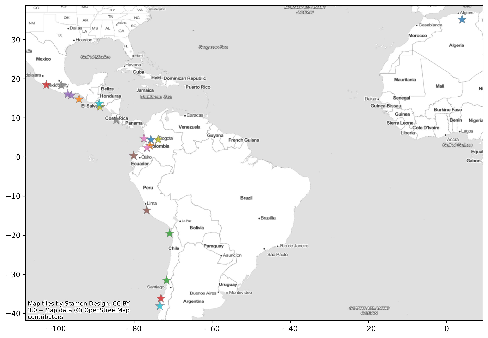

# GEMSA - Global Earthquake Scenario Archive

# ✨ Overview

> The v2023.0.0 release for the GEM's global earthquake scenario archive is available! 🥳 🚀

This repository is a collection of earthquake footprints and consequences from past events.

Find the global sumamry impact data in the [global_database folder](./global_database).

Additional information is available for the follwoing events:

| COUNTRY                  | YEAR | EVENTS                             | Mw   |
|--------------------------|------|------------------------------------|------|
| Algeria                  | 2003 | 20030521_M6.8_Boumerdes            | 6.8  |
| Botswana                 | 2017 | 20170403_M6.5_Moijabana            | 6.5  |
| Egypt                    | 1992 | 19921012_M5.9_Cairo                | 5.9  |
| Guinea                   | 1983 | 19831222_M6.3_Guinea               | 6.3  |
| Malawi                   | 1989 | 19890310_M6.3_Salima               | 6.3  |
| Malawi                   | 2009 | 20091219_M6.0_Karonga              | 6    |
| Morocco                  | 2004 | 20040224_M6.3_AlHoceima            | 6.3  |
| Tanzania                 | 2016 | 20160910_M5.9_Bukoba               | 5.9  |
| Chile                    | 1960 | 19600522_M9.5_Valdivia             | 9.5  |
| Chile                    | 2010 | 20100227_M8.8_Maule                | 8.8  |
| Chile                    | 2014 | 20140401_M8.2_Iquique              | 8.2  |
| Chile                    | 2015 | 20150916_M8.3_Illapel              | 8.3  |
| Colombia                 | 1983 | 19830331_M5.6_Popayan              | 5.6  |
| Colombia                 | 1994 | 19940606_M6.8_Cauca                | 6.8  |
| Colombia                 | 1999 | 19990125_M6.1_Armenia              | 6.1  |
| Colombia                 | 2004 | 20041115_M7.2_Pizarro              | 7.2  |
| Colombia                 | 2008 | 20080524_M5.9_Quetame              | 5.9  |
| Costa_Rica               | 2017 | 20171113_M6.5_Puntarenas           | 6.5  |
| Ecuador                  | 2016 | 20160416_M7.8_Pedernales           | 7.8  |
| El_Salvador              | 2001 | 20010113_M7.6_SanMiguel            | 7.6  |
| El_Salvador              | 2001 | 20010213_M6.6_SanSalvador          | 6.6  |
| Mexico                   | 1985 | 19850919_M8.1_Michoacan            | 8.1  |
| Mexico                   | 1999 | 19990930_M7.4_Oaxaca               | 7.4  |
| Mexico                   | 2017 | 20170908_M8.2_Chiapas              | 8.2  |
| Mexico                   | 2017 | 20170919_M7.1_Puebla               | 7.1  |
| Mexico                   | 2020 | 20200623_M7.4_Oaxaca               | 7.4  |
| Mexico                   | 2021 | 20210907_M7.1_Guerrero             | 7.1  |
| Peru                     | 2007 | 20070815_M7.9_Pisco                | 7.9  |
| United_States_of_America | 2014 | 20140824_M6.0_Napa                 | 6    |
| Iran                     | 1978 | 19780916_M7.3_Tabas                | 7.3  |
| Iran                     | 1990 | 19900620_M7.4_Manjil-Rudbar        | 7.4  |
| Iran                     | 1997 | 19970228_M6.1_Golestan             | 6.1  |
| Iran                     | 1997 | 19970510_M7.2_Qayen                | 7.2  |
| Iran                     | 2003 | 20031226_M6.6_Bam                  | 6.6  |
| Iran                     | 2005 | 20050222_M6.5_Zarand               | 6.5  |
| Iran                     | 2012 | 20120811_M6.5_Ahar-Varzaghan       | 6.5  |
| Iran                     | 2017 | 20171112_M7.4_SarpoleZahab         | 7.4  |
| Japan                    | 2016 | 20160416_M7.0_Kumamoto             | 7    |
| Japan                    | 2018 | 20180618_M5.5_Osaka                | 5.5  |
| Japan                    | 2018 | 20180906_M6.6_HokkaidoEasternIburi | 6.6  |
| Japan                    | 2019 | 20190618_M6.4_Yamagata             | 6.4  |
| Nepal                    | 2015 | 20150423_M7.8_Gorkha               | 7.8  |
| Albania                  | 2019 | 20191126_M6.4_Albania              | 6.4  |
| Croatia                  | 2020 | 20200322_M5.1_Zagreb               | 5.1  |
| Croatia                  | 2020 | 20201229_M6.3_Petrijna             | 6.3  |
| Cyprus                   | 1996 | 19961009_M6.8_Cyprus               | 6.8  |
| Greece                   | 1981 | 19810224_M6.7_GulfofCorinth        | 6.7  |
| Greece                   | 1981 | 19810225_M6.4_GulfofCorinth        | 6.4  |
| Greece                   | 1986 | 19860913_M6_Kalamata               | 6    |
| Greece                   | 1988 | 19881016_M5.88_Elia                | 5.88 |
| Greece                   | 1995 | 19950513_M6.5_KozaniGrevena        | 6.5  |
| Greece                   | 1995 | 19950615_M6.4_Aigio                | 6.4  |
| Greece                   | 1999 | 19990907_M5.9_Athens               | 5.9  |
| Greece                   | 2014 | 20140126_M6.1_Kefalonia            | 6.1  |
| Greece                   | 2014 | 20140203_M6_Kefalonia              | 6    |
| Greece                   | 2015 | 20151117_M6.5_Lefkada              | 6.5  |
| Greece                   | 2017 | 20170612_M6.3_AegeanSea            | 6.3  |
| Iceland                  | 2000 | 20000617_M5.87_Iceland             | 5.87 |
| Iceland                  | 2000 | 20000620_M6.46_Iceland             | 6.46 |
| Iceland                  | 2008 | 20080529_M6.32_Iceland             | 6.32 |
| Italy                    | 1980 | 19801123_M6.9_Irpinia              | 6.9  |
| Italy                    | 1990 | 19901213_M5.61_Augusta             | 5.61 |
| Italy                    | 1997 | 19970000_UmbriaMarche_sequence     | 6    |
| Italy                    | 2002 | 20020000_Molise_sequence           | 5.7  |
| Italy                    | 2004 | 20041124_M4.99_Gardone             | 4.99 |
| Italy                    | 2009 | 20090000_Laquila_sequence          | 6.2  |
| Italy                    | 2012 | 20120000_EmiliaRomagna_sequence    | 5.8  |
| Italy                    | 2016 | 20162017_CentralItaly_sequence     | 6.5  |
| Netherlands              | 1992 | 19920413_M5.3_Roermond             | 5.3  |
| Romania                  | 1990 | 19900530_M6.95_Vrancea             | 6.95 |
| Romania                  | 1990 | 19900531_M6.31_Vrancea             | 6.31 |
| Serbia                   | 2010 | 20101103_M5.52_Kraljevo            | 5.52 |
| Turkey                   | 1992 | 19920313_M6.68_Erzincan            | 6.68 |
| Turkey                   | 1995 | 19951001_M6.42_Dinar               | 6.42 |
| Turkey                   | 1998 | 19980627_M6.28_AdanaCeyhan         | 6.28 |
| Turkey                   | 1999 | 19990817_M7.53_Izmit               | 7.53 |
| Turkey                   | 1999 | 19991112_M6.71_Duzce               | 6.71 |
| Turkey                   | 2011 | 20111023_M7.1_Van                  | 7.1  |
| Turkey                   | 2020 | 20201030_M7_AegeanSea              | 7    |

# 🚀 Model versions  

Each version of the archive that is released can be accessed by changing from the `main` branch to the `tag` of a given version.
The `main` branch could contain the work-in-progress of the next version of the model.

| Version   | Release Notes                                                            |
|-----------|--------------------------------------------------------------------------|
| [v2023.0.0](https://github.com/gem/ecd/tree/v2023.0.0) | Original version with 100 earthquake scenario events.|

# 🌟 Contributors 

The authors are grateful for the input from dozens of collaborators. For each event, a list of contributors can be found in the main README page of the event.

# License
[![CC BY-NC-SA 4.0][cc-by-nc-sa-shield]][cc-by-nc-sa]

This work is licensed under a
[Creative Commons Attribution-NonCommercial-ShareAlike 4.0 International License][cc-by-nc-sa].

[![CC BY-NC-SA 4.0][cc-by-nc-sa-image]][cc-by-nc-sa]

[cc-by-nc-sa]: http://creativecommons.org/licenses/by-nc-sa/4.0/
[cc-by-nc-sa-image]: https://licensebuttons.net/l/by-nc-sa/4.0/88x31.png
[cc-by-nc-sa-shield]: https://img.shields.io/badge/License-CC%20BY--NC--SA%204.0-lightgrey.svg

# 🤔 Frequently asked questions 

### Which version am I seeing? How to change the version?
By default you will see the files in the repository in the  `main` branch. Each version of the model that is released can be accessed is marked with a `tag`. By changing the tag version at the top of the repository, you can change see the files for a given version.

Note that the `main` branch could contain the work-in-progress of the next version of the model.

### How do I download the data for a given version?
For each version, a related zip file is available in the [release section](https://github.com/gem/global_exposure_model/releases).

### Where can I find the models at the highest available resolution?

Please contact us at product@globalquakemodel.org
